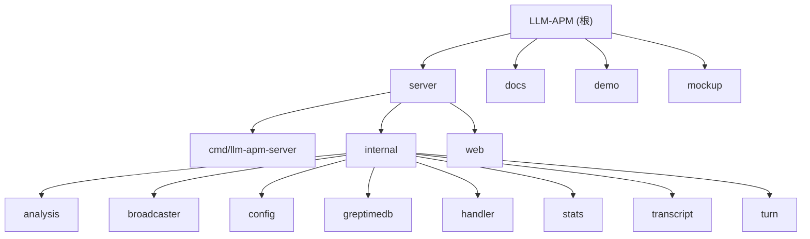

# LLM-APM 项目

> 基于 Hook 和 JSONL 的 LLM Agent APM 系统，用于快速分析和定位 Agent 执行问题。

## 变更记录 (Changelog)

| 时间 | 变更内容 |
|------|----------|
| 2026-05-24 11:13:31 | 初始化项目架构文档 |

---

## 项目愿景

构建一个全方位的 LLM Agent APM（应用性能监控）系统，为 Claude Code、Codex、Copilot CLI 等 Agent 提供：

- **性能分析**：Token 消耗、延迟、成本追踪
- **问题定位**：快速排查执行失败、工具调用异常、逻辑错误
- **执行回放**：完整的对话/工具调用时间线
- **智能分析**：自动异常检测、根因推断

相比传统 APM 的差异化定位：
- 轻量化设计，专注核心 APM 功能
- 内置 9 种异常检测规则 + 根因推断引擎
- 一键跳转到错误上下文，时间线高亮异常段
- SSE 实时推送关键事件（错误、异常、慢工具）

---

## 架构总览

```
┌─────────────────────────────────────────────────────────────────┐
│                        CLI Agents                                │
│   Claude Code | Codex | Copilot CLI                              │
└─────────────────────────────────────────────────────────────────┘
         │                    │                    │
         │ Hooks (HTTP)       │ JSONL files        │ JSONL files
         │ /api/hooks         │ ~/.claude/...      │ ~/.codex/...
         ▼                    ▼                    ▼
┌─────────────────────────────────────────────────────────────────┐
│                     llm-apm-server                               │
│  ┌──────────────┐  ┌──────────────┐  ┌──────────────────────┐   │
│  │ Hook Handler │  │ JSONL Watcher│  │ Analysis Engine      │   │
│  │ - 接收事件   │  │ - 监控文件   │  │ - 9 种检测规则       │   │
│  │ - 解析存储   │  │ - 解析写入   │  │ - 根因推断           │   │
│  │ - SSE广播    │  │ - 去重处理   │  │ - 关键事件筛选       │   │
│  └──────────────┘  └──────────────┘  └──────────────────────┘   │
│                            │                                     │
│                            ▼                                     │
│  ┌──────────────────────────────────────────────────────────┐   │
│  │                    SSE Broadcaster                        │   │
│  │  - 关键事件实时推送（错误、异常、慢工具）                 │   │
│  └──────────────────────────────────────────────────────────┘   │
└─────────────────────────────────────────────────────────────────┘
                            │
                            │ HTTP SQL API
                            ▼
┌─────────────────────────────────────────────────────────────────┐
│                       GreptimeDB                                 │
│  Tables:                                                         │
│  - apm_hook_events      (hook 事件)                             │
│  - apm_messages         (对话内容)                              │
│  - apm_anomalies        (检测到的异常)                          │
│  - apm_turns            (Turn 边界)                             │
└─────────────────────────────────────────────────────────────────┘
                            │
                            │ SQL Query
                            ▼
┌─────────────────────────────────────────────────────────────────┐
│                        Dashboard                                 │
│  Sessions View | Problems View | Analysis View                  │
│  (嵌入式 HTML 前端，原生 JS)                                     │
└─────────────────────────────────────────────────────────────────┘
```

---

## 模块结构图



---

## 模块索引

| 模块路径 | 语言 | 职责 | 入口文件 | 测试 | 文档 |
|----------|------|------|----------|------|------|
| **server/** | Go | Go 后端服务，核心 APM 功能 | `cmd/llm-apm-server/main.go` | 12 个测试文件 | [CLAUDE.md](./server/CLAUDE.md) |
| **docs/** | Markdown | 设计文档、规划、API 规范 | - | - | [CLAUDE.md](./docs/CLAUDE.md) |
| **demo/** | HTML | Dashboard 原型演示 | `dashboard-mockup.html` | - | - |
| **mockup/** | HTML | Dashboard 原型备份 | `dashboard-mockup.html` | - | - |

---

## 运行与开发

### 快速启动

```bash
# 编译并运行（需要 GreptimeDB）
cd server
make build
./start.sh

# 或直接运行
make run
```

### 端口配置

| 服务 | 默认端口 | 环境变量 |
|------|----------|----------|
| APM HTTP Server | 14318 | `APM_PORT` |
| GreptimeDB HTTP | 4000 | `APM_GREPTIMEDB_HTTP_PORT` |
| GreptimeDB MySQL | 14002 | `APM_GREPTIMEDB_MYSQL_PORT` |

### Hook 配置

Claude Code Hook 配置示例位于 `docs/hooks-config.json`，需添加到：
- `~/.claude/settings.json`（全局）
- `.claude/settings.json`（项目级）

### Makefile 命令

```bash
make build    # 编译二进制
make run      # 运行服务
make test     # 运行测试（race detector）
make vet      # 代码静态检查
make lint     # golangci-lint
make clean    # 清理编译产物
```

---

## 测试策略

项目采用 **Go 标准测试实践**：

- **覆盖率**：12 个测试文件，覆盖所有核心模块
- **并发检测**：使用 `go test -race` 检测竞态条件
- **测试文件分布**：
  - `analysis/*_test.go` - 异常检测和推断逻辑
  - `broadcaster/*_test.go` - SSE 广播器
  - `config/*_test.go` - 配置加载
  - `greptimedb/*_test.go` - 数据库表结构
  - `handler/*_test.go` - Hook 处理逻辑
  - `stats/*_test.go` - 统计聚合和成本计算
  - `turn/*_test.go` - Turn 边界追踪

**运行测试**：
```bash
cd server
make test  # go test -race -count=1 ./...
```

---

## 编码规范

### Go 代码规范

- **风格**：遵循 Go 标准格式（gofmt）
- **命名**：驼峰命名，包名简短
- **错误处理**：不忽略错误，记录日志
- **并发安全**：使用 `sync.RWMutex` 保护共享状态
- **SQL 注入**：使用 `escapeSQL()` 转义单引号

### 项目特定约定

- **Handler 函数命名**：`handleXxx` 模式（如 `handleHooks`）
- **内部包命名**：功能导向（如 `analysis`、`broadcaster`）
- **配置环境变量**：统一前缀 `APM_`
- **数据截断**：工具输入 2048 字符，工具结果 4096 字符

---

## AI 使用指引

### 推荐的上下文

当向 AI 提问时，推荐提供以下上下文：

1. **设计文档**：`docs/design/2024-01-15-llm-apm-design.md`（架构和数据模型）
2. **模块文档**：对应模块的 `CLAUDE.md`
3. **相关代码路径**：精确定位问题代码

### 常见任务提示

| 任务 | 推荐起点 |
|------|----------|
| 添加新的异常检测规则 | `server/internal/analysis/rules.go` |
| 新增 API endpoint | `server/internal/handler/handler.go` + 对应 handler 文件 |
| 修改数据表结构 | `server/internal/greptimedb/tables.go` |
| 优化成本计算 | `server/internal/stats/cost.go` |
| 添加 Turn 边界逻辑 | `server/internal/turn/tracker.go` |

### 避免的建议

- 不要直接粘贴大段代码，使用路径引用
- 不要修改 `.gitignore` 之外的配置文件
- 不要忽略测试覆盖，新功能应添加测试

---

## 相关文件清单

### 核心配置文件

| 文件 | 用途 |
|------|------|
| `server/go.mod` | Go 模块定义 |
| `server/Makefile` | 构建脚本 |
| `start.sh` | 启动脚本 |
| `docs/hooks-config.json` | Hook 配置示例 |

### 设计文档

| 文件 | 内容 |
|------|------|
| `docs/design/2024-01-15-llm-apm-design.md` | 系统架构、数据模型、API 设计 |
| `docs/superpowers/plans/*.md` | 功能规划文档 |
| `docs/superpowers/specs/*.md` | API 规范文档 |

### 前端文件

| 文件 | 内容 |
|------|------|
| `server/web/index.html` | Dashboard 主页面（嵌入式） |
| `server/web/web.go` | 嵌入静态资源的 Go 文件 |
| `demo/dashboard-mockup.html` | Dashboard 原型 |

---

## 多租户扩展预留

当前版本为单用户本地部署，但预留了多租户扩展：

- 所有核心表预留 `tenant_id` 字段
- API 预留认证扩展点
- Dashboard 预留登录和租户选择

详见设计文档 §10。

---

## 下一步建议

1. **补全 API 实现**：部分 Analysis API 使用 mock 数据，需接入真实查询
2. **完善前端交互**：Session Detail 页面的时间线渲染需要优化
3. **增加监控指标**：TTFT（首字节延迟）需要从 Hook 数据中提取
4. **优化成本模型**：当前使用简化估算，需接入真实定价 API