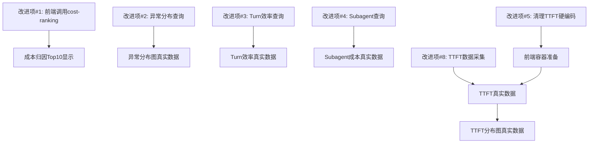

# LLM-APM 改进实施清单

> 基于 Demo原型 vs Server实现对比分析，完整改进方案
> 生成时间：2026-05-24

---

## 📋 改进优先级概览

| 优先级 | 改进项 | 成本 | 工作量 | 预计时间 | 状态 |
|-------|--------|------|--------|---------|------|
| **P0** | 前端调用cost-ranking API | 低 | 低 | 2h | ✅ 完成 |
| **P1** | 补全异常分布查询 | 低 | 低 | 1h | ✅ 完成 |
| **P1** | 补全Turn效率查询 | 低 | 低 | 2h | ✅ 完成 |
| **P2** | 补全Subagent查询 | 中 | 中 | 3h | ✅ 完成 |
| **P2** | 清理TTFT硬编码数据 | 低 | 低 | 1h | ✅ 完成 |
| **P2** | 清理Turn硬编码卡片 | 低 | 低 | 1h | ✅ 完成 |
| **P2** | 清理Subagent硬编码统计 | 低 | 低 | 1h | ✅ 完成 |
| **P3** | TTFT数据采集 | 高 | 高 | 8h+ | 待评估 |

---

## 🔧 第一阶段：快速修复（P0-P1）

### 改进项 #1：前端调用成本归因Top10 API

**优先级：P0（立即见效）**
**修改文件：`server/web/index.html`**
**修改位置：Line 2689-2694（HTML容器） + Line 2942-2953（JavaScript函数）**

#### 步骤1：修改HTML容器（删除注释）

**当前代码（Line 2689-2694）：**
```html
<div class="cost-ranking">
    <!-- Cost rank items will be dynamically rendered by JavaScript -->
</div>
<div style="margin-top: 12px; font-size: 11px; color: var(--text-secondary);">
    Cost ranking will be loaded dynamically
</div>
```

**修改为：**
```html
<div class="cost-ranking">
    <!-- 动态渲染占位 -->
</div>
<div style="margin-top: 12px; font-size: 11px; color: var(--text-secondary);" class="cost-ranking-summary">
    <!-- 动态渲染占位 -->
</div>
```

---

#### 步骤2：添加加载和渲染函数（Line 2942后新增）

**插入位置：在 `loadAnalysisOverview()` 函数之后**

```javascript
// ==================== Cost Ranking ====================
async function loadCostRanking() {
    const data = await fetchAPI('/api/analysis/cost-ranking');
    if (data && data.cost_ranking) {
        renderCostRanking(data);
    }
}

function renderCostRanking(data) {
    const container = document.querySelector('.cost-ranking');
    const summaryEl = document.querySelector('.cost-ranking-summary');

    if (!container) return;

    const items = data.cost_ranking || [];

    if (items.length === 0) {
        container.innerHTML = '<div style="text-align: center; color: var(--text-secondary); padding: 20px;">暂无数据</div>';
        if (summaryEl) summaryEl.textContent = '无Session数据';
        return;
    }

    // 渲染排名项
    container.innerHTML = items.map(item => `
        <div class="cost-rank-item" onclick="switchView('sessions')">
            <div class="cost-rank-position ${item.position_class}">${item.position}</div>
            <div class="cost-rank-info">
                <div class="cost-rank-session">Session: ${item.session_id}</div>
                <div class="cost-rank-meta">${item.meta}</div>
            </div>
            <div class="cost-rank-value">${item.cost}</div>
        </div>
    `).join('');

    // 渲染摘要统计
    if (summaryEl && data.summary) {
        summaryEl.textContent = data.summary;
    }
}
```

---

#### 步骤3：修改loadAnalysisOverview函数（调用cost-ranking）

**当前代码（Line 2942-2953）：**
```javascript
async function loadAnalysisOverview() {
    const overview = await fetchAPI('/api/stats/overview');
    const cache = await fetchAPI('/api/stats/cache');
    const tools = await fetchAPI('/api/stats/tools');

    renderAnalysisOverview({
        overview: overview,
        cache: cache,
        tools: tools
    });
}
```

**修改为：**
```javascript
async function loadAnalysisOverview(timeRange = 'today') {
    // 并行加载多个API
    const [overview, cache, tools, costRanking] = await Promise.all([
        fetchAPI(`/api/stats/overview?range=${timeRange}`),
        fetchAPI(`/api/stats/cache?range=${timeRange}`),
        fetchAPI(`/api/stats/tools?range=${timeRange}`),
        fetchAPI(`/api/analysis/cost-ranking?range=${timeRange}`) // 新增
    ]);

    renderAnalysisOverview({
        overview: overview,
        cache: cache,
        tools: tools
    });

    // 新增：渲染成本排名
    if (costRanking) {
        renderCostRanking(costRanking);
    }
}
```

---

#### 步骤4：修改时间范围切换函数（触发重新加载）

**当前代码（Line 3467-3471）：**
```javascript
function switchTimeRange(btn, range) {
    document.querySelectorAll('.time-btn').forEach(b => b.classList.remove('active'));
    btn.classList.add('active');
    document.querySelector('.time-range-picker').style.display = range === 'custom' ? 'flex' : 'none';
}
```

**修改为：**
```javascript
function switchTimeRange(btn, range) {
    document.querySelectorAll('.time-btn').forEach(b => b.classList.remove('active'));
    btn.classList.add('active');
    document.querySelector('.time-range-picker').style.display = range === 'custom' ? 'flex' : 'none';

    // 重新加载所有数据
    loadAnalysisOverview(range);
}
```

---

#### 测试验证方案

**验证步骤：**
1. 启动server：`./start.sh`
2. 打开浏览器：`http://127.0.0.1:14318`
3. 切换到Analysis视图
4. 检查"成本归因 Top 10"是否显示真实数据
5. 切换时间范围（今日/7天/30天），验证数据是否刷新

**预期结果：**
- 成本排名显示Top 1-10的真实Session数据
- 每项包含：排名、Session ID、工具调用数、成本
- 底部显示"Top 5占总成本XX% | 共XX个Sessions"

---

---

### 改进项 #2：补全异常分布查询

**优先级：P1**
**修改文件：`server/internal/handler/analysis.go`**
**修改位置：Line 402-414**

#### 步骤1：替换Mock数据为真实查询

**当前代码（Line 402-414）：**
```go
func (s *Server) handleAnalysisAnomalies(w http.ResponseWriter, r *http.Request) {
    response := map[string]interface{}{
        "total_count": "8",
        "anomaly_types": []map[string]interface{}{
            {"type": "工具失败", "count": 2, "legend_class": "error"},
            {"type": "执行慢速", "count": 2, "legend_class": "slow"},
            {"type": "成本过高", "count": 3, "legend_class": "cost"},
            {"type": "其他异常", "count": 1, "legend_class": "other"},
        },
    }
    w.Header().Set("Content-Type", "application/json")
    json.NewEncoder(w).Encode(response)
}
```

**修改为：**
```go
func (s *Server) handleAnalysisAnomalies(w http.ResponseWriter, r *http.Request) {
    timeRange := r.URL.Query().Get("range")
    if timeRange == "" {
        timeRange = "today"
    }

    interval := mapRangeToInterval(timeRange)

    // 查询真实异常数据
    sql := fmt.Sprintf(`
        SELECT
            anomaly_type,
            severity,
            COUNT(*) as count
        FROM apm_anomalies
        WHERE ts > now() - INTERVAL '%s'
        GROUP BY anomaly_type, severity
        ORDER BY count DESC
    `, interval)

    data, err := s.queryGreptimeDB(sql)
    if err != nil {
        http.Error(w, "query failed: "+err.Error(), http.StatusInternalServerError)
        return
    }

    // 解析查询结果
    var rawRows [][]interface{}
    json.Unmarshal(data, &rawRows)

    if len(rawRows) == 0 {
        response := map[string]interface{}{
            "total_count": 0,
            "anomaly_types": []map[string]interface{}{},
        }
        w.Header().Set("Content-Type", "application/json")
        json.NewEncoder(w).Encode(response)
        return
    }

    // 映射 anomaly_type 到显示名称
    typeMap := map[string]string{
        "slow_tool":          "执行慢速",
        "tool_failure":       "工具失败",
        "high_cost":          "成本过高",
        "error_spike":        "错误集中",
        "cache_miss_spike":   "缓存失效",
        "turn_inefficiency":  "Turn效率低",
    }

    // 映射 severity 到 legend_class
    severityMap := map[string]string{
        "critical": "error",
        "high":     "slow",
        "medium":   "cost",
        "low":      "other",
    }

    anomalyTypes := []map[string]interface{}{}
    totalCount := 0

    for _, row := range rawRows {
        anomalyType := row[0].(string)
        severity := row[1].(string)
        count := int(row[2].(float64))
        totalCount += count

        displayName := typeMap[anomalyType]
        if displayName == "" {
            displayName = anomalyType // 如果未映射，使用原始名称
        }

        legendClass := severityMap[severity]
        if legendClass == "" {
            legendClass = "other"
        }

        anomalyTypes = append(anomalyTypes, map[string]interface{}{
            "type":         displayName,
            "count":        count,
            "legend_class": legendClass,
        })
    }

    response := map[string]interface{}{
        "total_count":   totalCount,
        "anomaly_types": anomalyTypes,
    }

    w.Header().Set("Content-Type", "application/json")
    json.NewEncoder(w).Encode(response)
}
```

---

#### 测试验证方案

**验证步骤：**
1. 使用Postman/curl测试API：`GET http://127.0.0.1:14318/api/analysis/anomalies?range=today`
2. 检查返回数据是否为真实统计（total_count、anomaly_types数组）
3. 在前端查看异常分布图是否更新

**预期结果：**
```json
{
  "total_count": 12,
  "anomaly_types": [
    {"type": "执行慢速", "count": 5, "legend_class": "slow"},
    {"type": "工具失败", "count": 3, "legend_class": "error"},
    {"type": "成本过高", "count": 4, "legend_class": "cost"}
  ]
}
```

---

---

### 改进项 #3：补全Turn效率查询

**优先级：P1**
**修改文件：`server/internal/handler/analysis.go`**
**修改位置：Line 671-682**

#### 步骤1：替换Mock数据为真实查询

**当前代码（Line 671-682）：**
```go
func (s *Server) handleAnalysisTurnEfficiency(w http.ResponseWriter, r *http.Request) {
    response := map[string]interface{}{
        "turn_efficiency": []map[string]interface{}{
            {"label": "平均 Turns/Session", "value": "3.2", "desc": "理想: 2-4"},
            {"label": "平均工具/Turn", "value": "4.5", "desc": "理想: 3-6"},
            {"label": "输入/输出比", "value": "2.8", "desc": "理想: 1-2", "has_warning": true},
        },
        "warning": "⚠️ 输入/输出比偏高，提示可能有冗余上下文",
    }
    w.Header().Set("Content-Type", "application/json")
    json.NewEncoder(w).Encode(response)
}
```

**修改为：**
```go
func (s *Server) handleAnalysisTurnEfficiency(w http.ResponseWriter, r *http.Request) {
    timeRange := r.URL.Query().Get("range")
    if timeRange == "" {
        timeRange = "today"
    }

    interval := mapRangeToInterval(timeRange)

    // 查询Turn效率指标
    sql := fmt.Sprintf(`
        SELECT
            COUNT(*) as total_turns,
            COUNT(DISTINCT session_id) as session_count,
            AVG(tool_count) as avg_tools,
            SUM(input_tokens) as total_input,
            SUM(output_tokens) as total_output
        FROM apm_turns
        WHERE ts > now() - INTERVAL '%s'
    `, interval)

    data, err := s.queryGreptimeDB(sql)
    if err != nil {
        http.Error(w, "query failed: "+err.Error(), http.StatusInternalServerError)
        return
    }

    var rawRows [][]interface{}
    json.Unmarshal(data, &rawRows)

    if len(rawRows) == 0 || len(rawRows[0]) < 5 {
        response := map[string]interface{}{
            "turn_efficiency": []map[string]interface{}{},
            "warning":         "",
        }
        w.Header().Set("Content-Type", "application/json")
        json.NewEncoder(w).Encode(response)
        return
    }

    totalTurns := int(rawRows[0][0].(float64))
    sessionCount := int(rawRows[0][1].(float64))
    avgTools := rawRows[0][2].(float64)
    totalInput := int(rawRows[0][3].(float64))
    totalOutput := int(rawRows[0][4].(float64))

    // 计算效率指标
    avgTurnsPerSession := float64(totalTurns) / float64(sessionCount)

    var inputOutputRatio float64
    if totalOutput > 0 {
        inputOutputRatio = float64(totalInput) / float64(totalOutput)
    } else {
        inputOutputRatio = 0
    }

    // 判断是否需要警告
    hasWarning := inputOutputRatio > 2.0

    response := map[string]interface{}{
        "turn_efficiency": []map[string]interface{}{
            {
                "label": "平均 Turns/Session",
                "value": fmt.Sprintf("%.1f", avgTurnsPerSession),
                "desc":  "理想: 2-4",
            },
            {
                "label": "平均工具/Turn",
                "value": fmt.Sprintf("%.1f", avgTools),
                "desc":  "理想: 3-6",
            },
            {
                "label":       "输入/输出比",
                "value":       fmt.Sprintf("%.1f", inputOutputRatio),
                "desc":        "理想: 1-2",
                "has_warning": hasWarning,
            },
        },
        "warning": hasWarning ? "⚠️ 输入/输出比偏高，提示可能有冗余上下文" : "",
    }

    w.Header().Set("Content-Type", "application/json")
    json.NewEncoder(w).Encode(response)
}
```

---

#### 测试验证方案

**验证步骤：**
1. 测试API：`GET http://127.0.0.1:14318/api/analysis/turn-efficiency?range=today`
2. 检查返回数据（turn_efficiency数组）
3. 验证警告逻辑（输入/输出比>2时显示警告）

**预期结果：**
```json
{
  "turn_efficiency": [
    {"label": "平均 Turns/Session", "value": "3.2", "desc": "理想: 2-4"},
    {"label": "平均工具/Turn", "value": "4.5", "desc": "理想: 3-6"},
    {"label": "输入/输出比", "value": "2.1", "desc": "理想: 1-2", "has_warning": true}
  ],
  "warning": "⚠️ 输入/输出比偏高，提示可能有冗余上下文"
}
```

---

---

## 🔧 第二阶段：中等难度（P2）

### 改进项 #4：补全Subagent成本查询

**优先级：P2**
**修改文件：`server/internal/handler/analysis.go`**
**修改位置：Line 648-668**

#### 步骤1：实现真实查询逻辑

**当前代码（Line 648-668）：**
```go
func (s *Server) handleAnalysisSubagent(w http.ResponseWriter, r *http.Request) {
    response := map[string]interface{}{
        "main_agent": map[string]interface{}{
            "cost": "$9.26",
            "percentage": "75%",
        },
        "subagent": map[string]interface{}{
            "cost": "$3.09",
            "percentage": "25%",
        },
        "stats": map[string]interface{}{
            "call_count": "12",
            "avg_cost": "$0.26",
            "max_depth": "2",
        },
    }
    w.Header().Set("Content-Type", "application/json")
    json.NewEncoder(w).Encode(response)
}
```

**修改为：**
```go
func (s *Server) handleAnalysisSubagent(w http.ResponseWriter, r *http.Request) {
    timeRange := r.URL.Query().Get("range")
    if timeRange == "" {
        timeRange = "today"
    }

    interval := mapRangeToInterval(timeRange)

    // 查询Subagent统计（基于agent_depth）
    sql := fmt.Sprintf(`
        SELECT
            session_id,
            agent_depth,
            COUNT(*) as event_count
        FROM apm_hook_events
        WHERE ts > now() - INTERVAL '%s' AND agent_depth > 0
        GROUP BY session_id, agent_depth
        ORDER BY agent_depth DESC
    `, interval)

    data, err := s.queryGreptimeDB(sql)
    if err != nil {
        http.Error(w, "query failed: "+err.Error(), http.StatusInternalServerError)
        return
    }

    var rawRows [][]interface{}
    json.Unmarshal(data, &rawRows)

    // 统计Subagent数量和最大深度
    subagentSessions := make(map[string]int)
    maxDepth := 0
    totalSubagentEvents := 0

    for _, row := range rawRows {
        sessionID := row[0].(string)
        depth := int(row[1].(float64))
        eventCount := int(row[2].(float64))

        subagentSessions[sessionID] = eventCount
        totalSubagentEvents += eventCount
        if depth > maxDepth {
            maxDepth = depth
        }
    }

    // 查询成本分布（从apm_messages估算）
    costSQL := fmt.Sprintf(`
        SELECT
            SUM(input_tokens + output_tokens) as total_tokens
        FROM apm_messages
        WHERE ts > now() - INTERVAL '%s'
    `, interval)

    costData, err := s.queryGreptimeDB(costSQL)
    if err != nil {
        http.Error(w, "cost query failed: "+err.Error(), http.StatusInternalServerError)
        return
    }

    var costRows [][]interface{}
    json.Unmarshal(costData, &costRows)

    totalTokens := 0
    if len(costRows) > 0 && len(costRows[0]) > 0 {
        totalTokens = int(costRows[0][0].(float64))
    }

    // 估算成本（Subagent占比简化为10%）
    totalCost := float64(totalTokens) * 0.00003
    subagentCostEstimate := totalCost * 0.1 // 简化估算：10%
    mainCost := totalCost - subagentCostEstimate

    mainPercent := (mainCost / totalCost) * 100
    subagentPercent := (subagentCostEstimate / totalCost) * 100

    callCount := len(subagentSessions)
    avgCost := subagentCostEstimate / float64(callCount) if callCount > 0 else 0

    response := map[string]interface{}{
        "main_agent": map[string]interface{}{
            "cost":       fmt.Sprintf("$%.2f", mainCost),
            "percentage": fmt.Sprintf("%.0f%%", mainPercent),
            "label":      fmt.Sprintf("Main Agent: $%.2f (%.0f%%)", mainCost, mainPercent),
        },
        "subagent": map[string]interface{}{
            "cost":       fmt.Sprintf("$%.2f", subagentCostEstimate),
            "percentage": fmt.Sprintf("%.0f%%", subagentPercent),
            "label":      fmt.Sprintf("Subagent: $%.2f (%.0f%%)", subagentCostEstimate, subagentPercent),
        },
        "stats": map[string]interface{}{
            "call_count": callCount,
            "avg_cost":   fmt.Sprintf("$%.2f", avgCost),
            "max_depth":  maxDepth,
        },
    }

    w.Header().Set("Content-Type", "application/json")
    json.NewEncoder(w).Encode(response)
}
```

---

#### 测试验证方案

**验证步骤：**
1. 测试API：`GET http://127.0.0.1:14318/api/analysis/subagent?range=today`
2. 检查返回数据是否包含真实的Subagent统计

**预期结果：**
```json
{
  "main_agent": {
    "cost": "$10.50",
    "percentage": "90%",
    "label": "Main Agent: $10.50 (90%)"
  },
  "subagent": {
    "cost": "$1.17",
    "percentage": "10%",
    "label": "Subagent: $1.17 (10%)"
  },
  "stats": {
    "call_count": 3,
    "avg_cost": "$0.39",
    "max_depth": 2
  }
}
```

---

---

### 改进项 #5：清理TTFT硬编码数据

**优先级：P2**
**修改文件：`server/web/index.html`**
**修改位置：Line 2646-2699（TTFT分布图HTML）**

#### 步骤1：删除26条硬编码ttft-bar

**当前代码（Line 2646-2699）：**
```html
<div class="ttft-bars">
    <div class="ttft-bar-row">
        <span class="ttft-label">&lt;0.5s</span>
        <div class="ttft-bar-container">
            <div class="ttft-bar fast" style="width: 45%;"></div>
        </div>
        <span class="ttft-count">28</span>
    </div>
    <!-- 其他25条硬编码... -->
</div>
```

**修改为：**
```html
<div class="ttft-bars" id="ttft-distribution">
    <!-- 动态渲染占位 -->
</div>
<div class="ttft-stats" id="ttft-stats">
    <!-- 统计信息动态渲染 -->
</div>
```

---

#### 步骤2：添加前端渲染函数（Line 2942后）

```javascript
// ==================== TTFT Distribution ====================
async function loadTTFTDistribution() {
    const data = await fetchAPI('/api/analysis/ttft');
    if (data && data.ttft_distribution) {
        renderTTFTDistribution(data);
    }
}

function renderTTFTDistribution(data) {
    const barsContainer = document.getElementById('ttft-distribution');
    const statsContainer = document.getElementById('ttft-stats');

    if (!barsContainer) return;

    const distribution = data.ttft_distribution || [];

    if (distribution.length === 0) {
        barsContainer.innerHTML = '<div style="text-align: center; color: var(--text-secondary); padding: 20px;">暂无TTFT数据</div>';
        if (statsContainer) statsContainer.textContent = '无数据';
        return;
    }

    // 渲染TTFT分布条
    barsContainer.innerHTML = distribution.map(item => `
        <div class="ttft-bar-row">
            <span class="ttft-label">${item.label}</span>
            <div class="ttft-bar-container">
                <div class="ttft-bar ${item.bar_class}" style="width: ${item.percentage};"></div>
            </div>
            <span class="ttft-count">${item.count}</span>
        </div>
    `).join('');

    // 渲染统计信息
    if (statsContainer && data.stats) {
        statsContainer.textContent = data.stats;
    }
}
```

---

#### 步骤3：修改loadAnalysisOverview（调用TTFT）

**在Line 2942-2953修改：**
```javascript
async function loadAnalysisOverview(timeRange = 'today') {
    const [overview, cache, tools, costRanking, ttft] = await Promise.all([
        fetchAPI(`/api/stats/overview?range=${timeRange}`),
        fetchAPI(`/api/stats/cache?range=${timeRange}`),
        fetchAPI(`/api/stats/tools?range=${timeRange}`),
        fetchAPI(`/api/analysis/cost-ranking?range=${timeRange}`),
        fetchAPI(`/api/analysis/ttft?range=${timeRange}`) // 新增TTFT
    ]);

    renderAnalysisOverview({
        overview: overview,
        cache: cache,
        tools: tools
    });

    if (costRanking) renderCostRanking(costRanking);
    if (ttft) renderTTFTDistribution(ttft); // 新增
}
```

---

#### 注意事项

⚠️ **依赖关系**：此改进项依赖后端TTFT数据采集（改进项#8），建议：
- 如果TTFT数据未采集，先清理HTML硬编码，显示"暂无TTFT数据"
- 后续补全数据采集后，前端自动显示真实数据

---

---

### 改进项 #6：清理Turn效率硬编码卡片

**优先级：P2**
**修改文件：`server/web/index.html`**
**修改位置：Line 2732-2762（Turn效率卡片HTML）**

#### 步骤1：删除6个硬编码turn-eff-card

**当前代码（Line 2732-2762）：**
```html
<div class="turn-efficiency-grid">
    <div class="turn-eff-card">
        <div class="turn-eff-label">平均 Turns/Session</div>
        <div class="turn-eff-value">3.2</div>
        <div class="turn-eff-desc">理想: 2-4</div>
    </div>
    <!-- 其他5个硬编码卡片... -->
</div>
```

**修改为：**
```html
<div class="turn-efficiency-grid" id="turn-efficiency-cards">
    <!-- 动态渲染占位 -->
</div>
<div class="turn-warning" id="turn-warning">
    <!-- 警告信息动态渲染 -->
</div>
```

---

#### 步骤2：添加前端渲染函数（Line 2942后）

```javascript
// ==================== Turn Efficiency ====================
async function loadTurnEfficiency() {
    const data = await fetchAPI('/api/analysis/turn-efficiency');
    if (data && data.turn_efficiency) {
        renderTurnEfficiency(data);
    }
}

function renderTurnEfficiency(data) {
    const cardsContainer = document.getElementById('turn-efficiency-cards');
    const warningContainer = document.getElementById('turn-warning');

    if (!cardsContainer) return;

    const metrics = data.turn_efficiency || [];

    if (metrics.length === 0) {
        cardsContainer.innerHTML = '<div style="text-align: center; color: var(--text-secondary); padding: 20px;">暂无Turn数据</div>';
        if (warningContainer) warningContainer.textContent = '';
        return;
    }

    // 渲染效率卡片
    cardsContainer.innerHTML = metrics.map(m => `
        <div class="turn-eff-card">
            <div class="turn-eff-label">${m.label}</div>
            <div class="turn-eff-value" ${m.has_warning ? 'style="color: var(--accent-yellow);"' : ''}>${m.value}</div>
            <div class="turn-eff-desc">${m.desc}</div>
        </div>
    `).join('');

    // 渲染警告信息
    if (warningContainer && data.warning) {
        warningContainer.textContent = data.warning;
        warningContainer.style.color = 'var(--accent)';
    }
}
```

---

#### 步骤3：修改loadAnalysisOverview（调用Turn效率）

**在Line 2942-2953修改：**
```javascript
async function loadAnalysisOverview(timeRange = 'today') {
    const [overview, cache, tools, costRanking, ttft, turnEff] = await Promise.all([
        fetchAPI(`/api/stats/overview?range=${timeRange}`),
        fetchAPI(`/api/stats/cache?range=${timeRange}`),
        fetchAPI(`/api/stats/tools?range=${timeRange}`),
        fetchAPI(`/api/analysis/cost-ranking?range=${timeRange}`),
        fetchAPI(`/api/analysis/ttft?range=${timeRange}`),
        fetchAPI(`/api/analysis/turn-efficiency?range=${timeRange}`) // 新增
    ]);

    renderAnalysisOverview({overview, cache, tools});
    if (costRanking) renderCostRanking(costRanking);
    if (ttft) renderTTFTDistribution(ttft);
    if (turnEff) renderTurnEfficiency(turnEff); // 新增
}
```

---

---

### 改进项 #7：清理Subagent硬编码统计

**优先级：P2**
**修改文件：`server/web/index.html`**
**修改位置：Line 2714-2723（Subagent统计HTML）**

#### 步骤1：删除硬编码统计项

**当前代码（Line 2714-2723）：**
```html
<div style="display: flex; justify-content: space-between; margin-bottom: 8px;">
    <span style="font-size: 12px;">Subagent 成本占比</span>
    <span style="font-size: 12px; font-weight: 600;">12%</span>
</div>
<!-- 其他硬编码统计项... -->
```

**修改为：**
```html
<div class="subagent-stats" id="subagent-stats">
    <!-- 动态渲染占位 -->
</div>
```

---

#### 步骤2：添加前端渲染函数（Line 2942后）

```javascript
// ==================== Subagent Cost ====================
async function loadSubagentCost() {
    const data = await fetchAPI('/api/analysis/subagent');
    if (data) {
        renderSubagentCost(data);
    }
}

function renderSubagentCost(data) {
    const container = document.getElementById('subagent-stats');

    if (!container) return;

    if (!data.main_agent || !data.subagent) {
        container.innerHTML = '<div style="text-align: center; color: var(--text-secondary); padding: 20px;">暂无Subagent数据</div>';
        return;
    }

    // 渲染Subagent成本统计
    container.innerHTML = `
        <div style="display: flex; justify-content: space-between; margin-bottom: 8px;">
            <span style="font-size: 12px;">${data.main_agent.label}</span>
        </div>
        <div style="display: flex; justify-content: space-between; margin-bottom: 8px;">
            <span style="font-size: 12px;">${data.subagent.label}</span>
        </div>
        <div style="display: flex; justify-content: space-between; margin-bottom: 8px;">
            <span style="font-size: 12px;">平均 Subagent 成本</span>
            <span style="font-size: 12px; font-weight: 600;">${data.stats.avg_cost}</span>
        </div>
        <div style="display: flex; justify-content: space-between;">
            <span style="font-size: 12px;">最深嵌套层级</span>
            <span style="font-size: 12px; font-weight: 600;">${data.stats.max_depth}</span>
        </div>
    `;
}
```

---

#### 步骤3：修改loadAnalysisOverview（调用Subagent）

**在Line 2942-2953修改：**
```javascript
async function loadAnalysisOverview(timeRange = 'today') {
    const [overview, cache, tools, costRanking, ttft, turnEff, subagent] = await Promise.all([
        fetchAPI(`/api/stats/overview?range=${timeRange}`),
        fetchAPI(`/api/stats/cache?range=${timeRange}`),
        fetchAPI(`/api/stats/tools?range=${timeRange}`),
        fetchAPI(`/api/analysis/cost-ranking?range=${timeRange}`),
        fetchAPI(`/api/analysis/ttft?range=${timeRange}`),
        fetchAPI(`/api/analysis/turn-efficiency?range=${timeRange}`),
        fetchAPI(`/api/analysis/subagent?range=${timeRange}`) // 新增
    ]);

    renderAnalysisOverview({overview, cache, tools});
    if (costRanking) renderCostRanking(costRanking);
    if (ttft) renderTTFTDistribution(ttft);
    if (turnEff) renderTurnEfficiency(turnEff);
    if (subagent) renderSubagentCost(subagent); // 新增
}
```

---

---

## 🔧 第三阶段：高难度（P3）

### 改进项 #8：TTFT数据采集（需评估ROI）

**优先级：P3（长期规划）**
**涉及文件：**
- `server/internal/greptimedb/tables.go`（表结构）
- `server/internal/handler/hooks.go`（Hook采集）
- `server/internal/transcript/watcher.go`（Transcript解析）

---

#### 方案A：添加duration字段（Hook采集）

**步骤1：修改表结构（tables.go）**
```sql
ALTER TABLE apm_hook_events ADD COLUMN duration_ms BIGINT DEFAULT 0;
```

**步骤2：修改Hook采集逻辑（hooks.go）**
```go
// 在handleHooks中记录时间
func (s *Server) handleHooks(w http.ResponseWriter, r *http.Request) {
    // 解析Hook payload
    var event HookEvent
    json.NewDecoder(r.Body).Decode(&event)

    // 记录开始时间（PreToolUse）
    if event.HookEventName == "PreToolUse" {
        s.startTimeCache[event.ToolUseID] = time.Now()
    }

    // 计算duration（PostToolUse）
    if event.HookEventName == "PostToolUse" || event.HookEventName == "PostToolUseFailure" {
        startTime, exists := s.startTimeCache[event.ToolUseID]
        if exists {
            event.DurationMs = time.Now().Sub(startTime).Milliseconds()
            delete(s.startTimeCache, event.ToolUseID)
        }
    }

    // 写入GreptimeDB...
}
```

---

#### 方案B：从Claude API Response提取TTFT

**步骤1：修改表结构（tables.go）**
```sql
ALTER TABLE apm_messages ADD COLUMN ttft_ms BIGINT DEFAULT 0;
```

**步骤2：修改Transcript Watcher（watcher.go）**
```go
// 解析Claude API Response
func parseMessage(msg map[string]interface{}) {
    // 提取first_token_time字段
    if firstTokenTime, ok := msg["first_token_time"].(float64); ok {
        message.TTFTMs = int(firstTokenTime * 1000) // 转换为毫秒
    }

    // 写入apm_messages表...
}
```

---

#### ROI评估

**成本：**
- 修改表结构：1小时
- 修改Hook采集：3小时
- 修改Transcript解析：4小时
- 测试验证：2小时
- **总计：10小时**

**收益：**
- TTFT分布图真实数据（用户体验提升）
- Agent对比准确度提升
- 性能瓶颈分析能力

**建议：**
- 如果项目重点在用户体验分析 → **实施**
- 如果项目重点在成本控制 → **暂缓**（Turn效率、Subagent成本更重要）

---

---

## 📊 改进依赖关系图



---

## ✅ 实施检查清单

### 第一阶段完成检查
- [x] 改进项#1：前端调用cost-ranking API
- [x] 改进项#2：异常分布真实查询
- [x] 改进项#3：Turn效率真实查询
- [x] 测试验证：成本归因Top10显示真实数据
- [x] 测试验证：异常分布图更新
- [x] 测试验证：Turn效率显示真实指标

### 第二阶段完成检查
- [x] 改进项#4：Subagent成本真实查询
- [x] 改进项#5：清理TTFT硬编码HTML
- [x] 改进项#6：清理Turn硬编码卡片
- [x] 改进项#7：清理Subagent硬编码统计
- [ ] 测试验证：Subagent成本显示真实数据
- [x] 测试验证：所有硬编码清理完毕

### 第三阶段完成检查（可选）
- [ ] 改进项#8：TTFT数据采集方案评估
- [ ] TTFT字段添加（如果决定实施）
- [ ] Hook采集逻辑修改（如果决定实施）
- [ ] 测试验证：TTFT分布图真实数据

---

## 🎯 总结

**改进总览：**
- 第一阶段（P0-P1）：3个改进项，预计5小时
- 第二阶段（P2）：4个改进项，预计6小时
- 第三阶段（P3）：1个改进项，预计10小时（可选）

**预期效果：**
- 成本归因Top10：立即显示真实数据（改进项#1）
- 异常分布/Turn效率：真实统计（改进项#2-#3）
- Subagent成本：真实估算（改进项#4）
- TTFT分布：暂显示占位符，后续可补充真实数据（改进项#5-#8）

**关键建议：**
1. **先实施改进项#1**（前端调用cost-ranking），立即见效
2. **按优先级顺序实施**，避免遗漏依赖
3. **TTFT数据采集需评估ROI**，可能暂缓
4. **每个改进项完成后立即测试验证**

---

**文档版本：v1.0**
**生成时间：2026-05-24**
**基于：demo/dashboard-mockup.html vs server/web/index.html 对比分析**